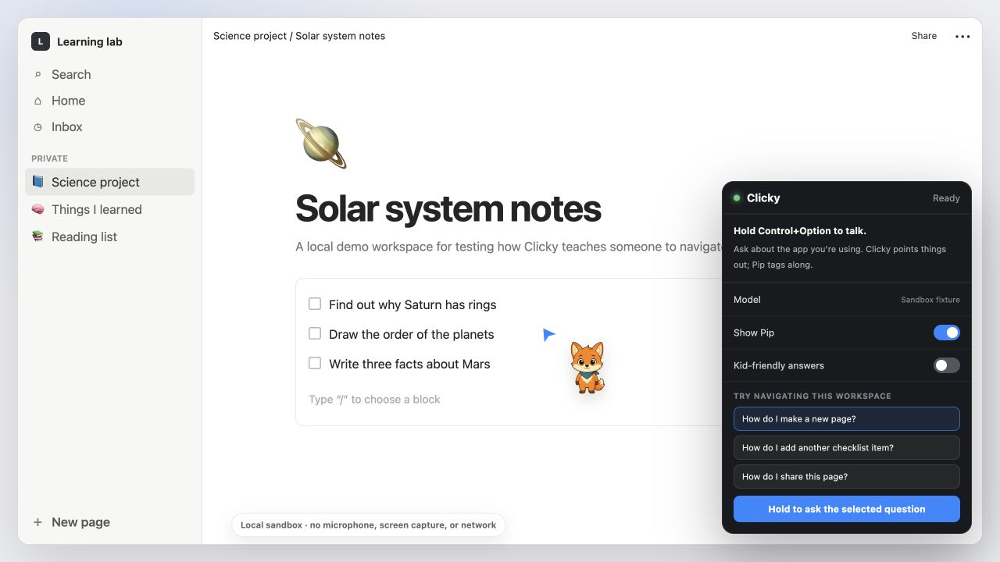
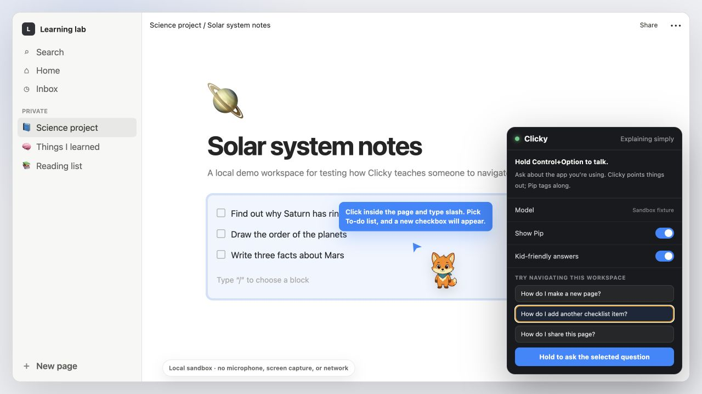

# Clicky sandbox

This is a deterministic, dependency-free simulation of the original Hey Clicky interaction inside a local productivity-style workspace. It does not request microphone or screen permissions and makes no network calls.

From the repository root:

```bash
python3 -m http.server 8765 --bind 127.0.0.1
```

Open `http://127.0.0.1:8765/sandbox/`.

The static harness can also run in a container:

```bash
docker build -f sandbox/Dockerfile -t clicky-sandbox .
docker run --rm -p 8765:80 clicky-sandbox
```

The browser fixture is a QA and demonstration surface, not a replacement for the native macOS app. The native app keeps Clicky's ScreenCaptureKit, voice, model, TTS, and blue-pointer workflow.

## Preview



Pip mirrors Clicky's existing pointer and response state while the original navigation flow stays in control.



The kid-friendly setting changes the explanation style without changing how Clicky selects or points to interface targets.
